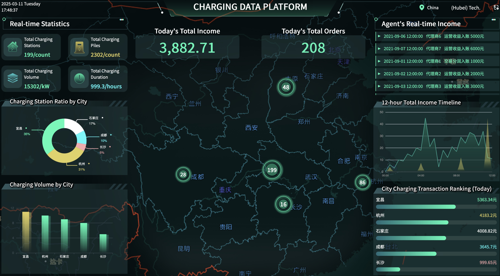

# 项目技术栈 | Project Tech Stack

该项目采用了以下现代前端技术栈：
This project uses the following modern front-end technology stack:

## 核心框架与语言 | Core Framework & Language
- Vue 3 框架，使用组合式 API (Composition API) | Vue 3 framework with Composition API
- TypeScript 进行类型安全开发 | TypeScript for type-safe development
- uno-css 类 tailwind 开发 | uno-css like tailwind

## 工具库 | Utility Libraries
- dayjs：用于日期和时间格式化 | dayjs: for date and time formatting
- 国际化 (i18n) 支持，实现中英文切换 | Internationalization (i18n) support for Chinese/English switching

## 样式与布局 | Styling & Layout
- Less 预处理器 | Less preprocessor
- 响应式设计 | Responsive design

## 自定义 Hooks | Custom Hooks
项目实现了多个可复用的组合式函数：
The project implements multiple reusable composition functions:
- `useElementSize`：跟踪元素尺寸变化，利用 ResizeObserver API | Tracks element size changes using ResizeObserver API
- `useDevicePixelRatio`：监控设备像素比变化 | Monitors device pixel ratio changes

## 浏览器 API | Browser APIs
- ResizeObserver：用于监听元素大小变化 | Used to listen for element size changes
- MediaQueryList：用于检测设备像素比变化 | Used to detect device pixel ratio changes
- 事件监听器：管理组件生命周期和资源清理 | Event listeners: managing component lifecycle and resource cleanup

## 亮点 | Highlights
- 国际化 (i18n) 支持 | Internationalization (i18n) support
- 大屏按比例缩放,支持各类屏幕 | Large screen proportional scaling, supporting various screen types
- 根据 ratio 不同加载不同分辨率的图片 | Loading different resolution images based on device ratio
- svg 动画 | SVG animations

